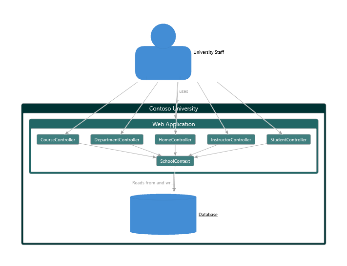
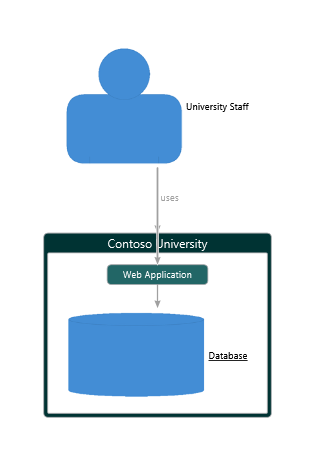

# Structurizr.Dgml

## Description
Structurizr.Dgml is a small `DotNet` library for converting Structurizr's C4 models to corresponding  `DGML` graphs. 

Checkout the following for more information:
* https://structurizr.com/
* https://github.com/merijndejonge/DgmlBuilder
## Example
Below is an example that shows how the Contoso University example has been converted to DGML:


In the Visual Studio DGML viewer you can collapse different elements of the model to focus on different aspect of the model:

 
##  Using Structurizr.Dgml
Given an C4 model in a `Structurizr.Workspace` instance, you can simply convert the model to Dgml with the extention method `ToDgml()`. I.e.,
```csharp
using OpenSoftware.DgmlTools.Model;
using OpenSoftware.Structurizr.Dgml;
using Structurizr;

namespace MyC4Model
{
    class Program
    {
        static void Main(string[] args)
        {
            var workspace = new Workspace("My model", "This is an example C4 model.");
            // Fill your model here (see https://github.com/structurizr/dotnet)

            // Convert to DGML
            var dgml = workspace.ToDgml();
            // Write to file
            dgml.WriteToFile("c4model.dgml");
        }
    }
}

```
You can then open the file `c4model.dgml` in Visual Studio to view and analyze it. You can find more information about creating a C4 model for dotnet at https://github.com/structurizr/dotnet.
## More info
Source code of `Structurizr.Dgml` is available at [GitHub](https://github.com/merijndejonge/Structurizr.Dgml). Nuget packages are available at [Nuget.org](https://www.nuget.org/packages/Structurizr.Dgml).

`Structurizr.Dgml` is distributed under the [Apache 2.0 License](https://github.com/merijndejonge/Structurizr.Dgml/blob/master/LICENSE).
